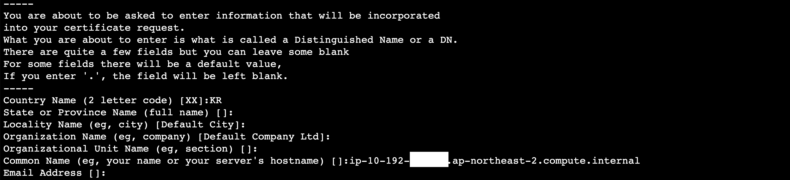
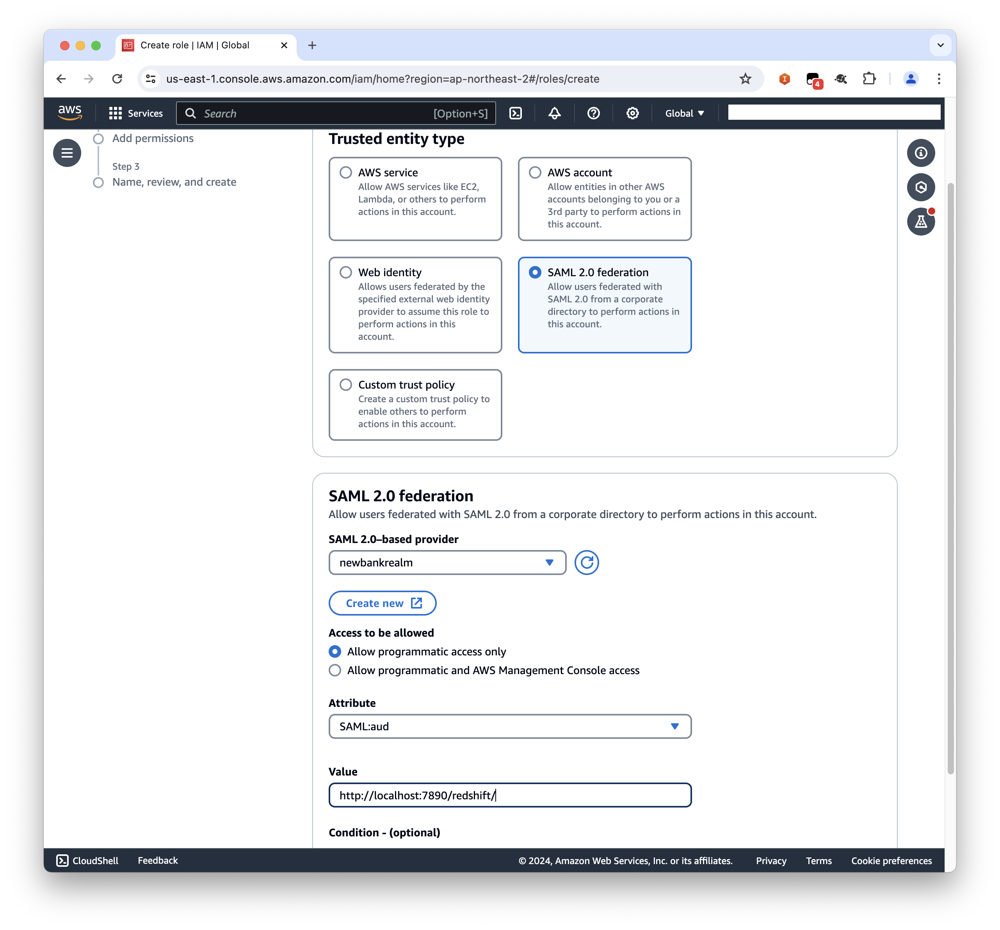
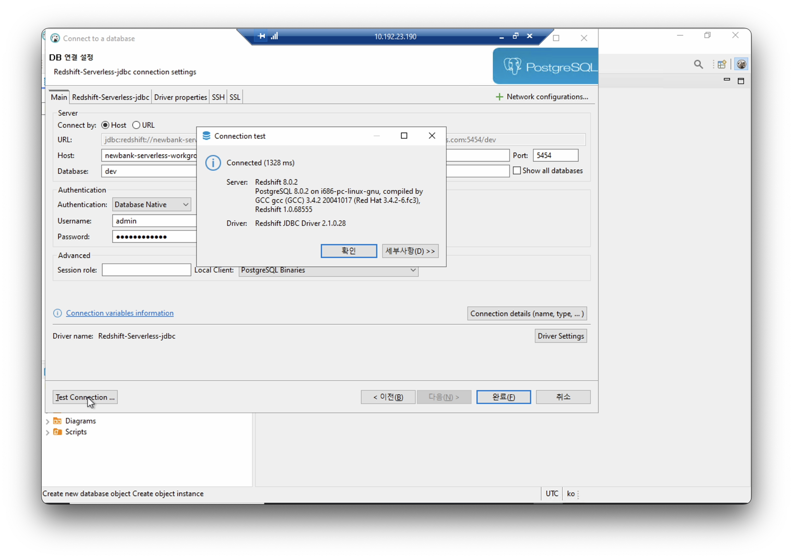
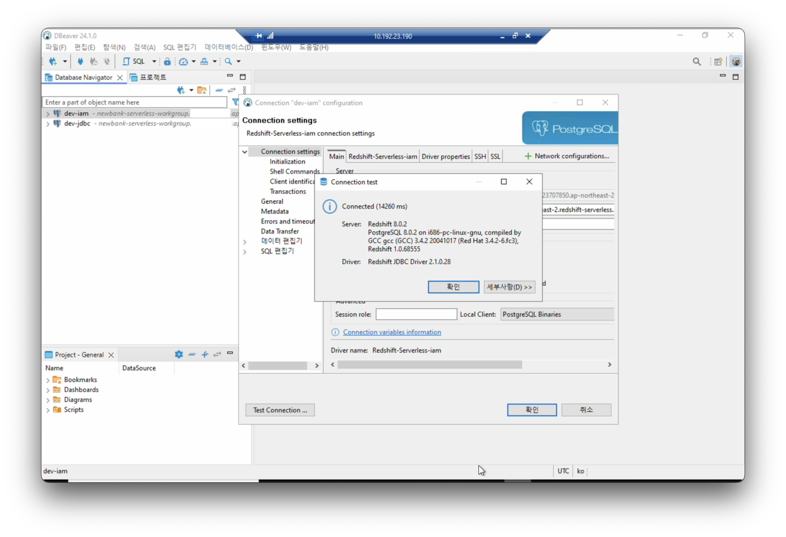
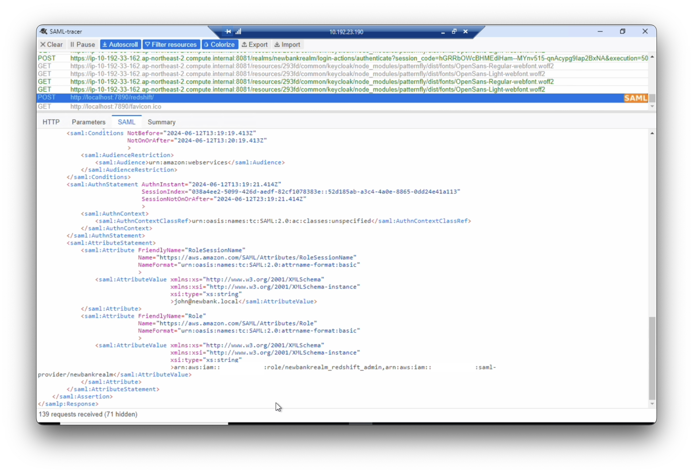
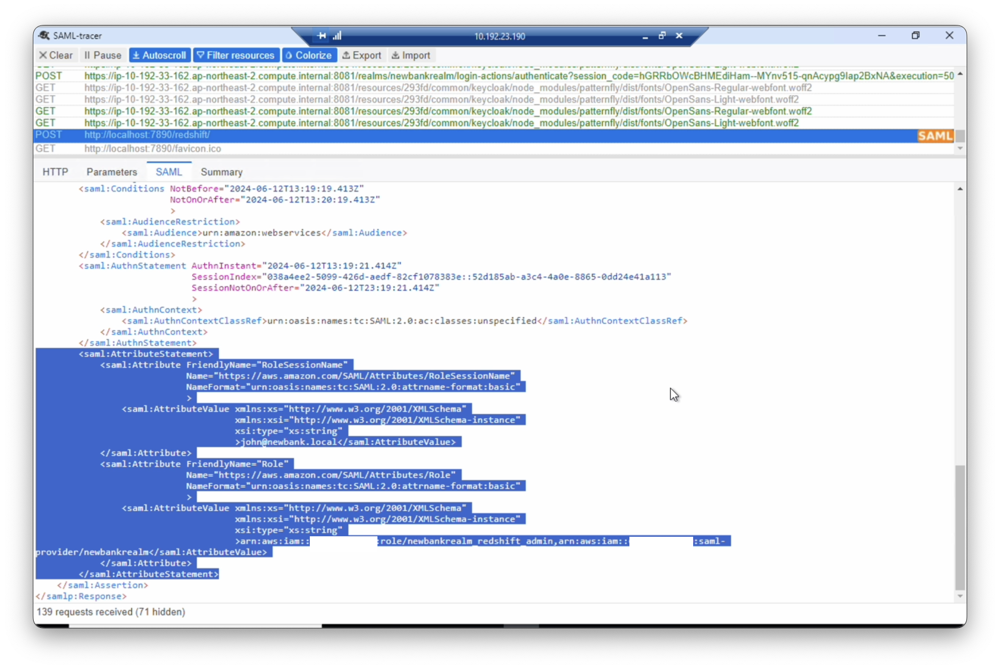
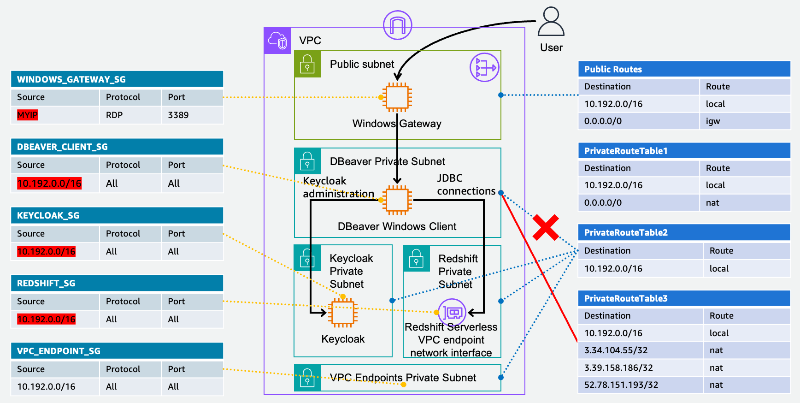

# redshift-serverless-with-saml
> Redshift Serverless, SAML, Keycloak, DBeaver

# VPC 구성
* 다운로드 [YAML](https://github.com/shinjoonghoon/redshift-serverless-with-saml/blob/main/redshift-serverless-with-saml.yaml).
  - Stack name: `newbank`
  - EnvironmentName: `newbank`
* yaml 배포 후 VPC 다이어그램
  </img>
* 환경 변수 정의
  ```
  VPC_ID=vpc-12345678901234567
  ```
  ```
  REGION=$(aws configure get region)
  ACCOUNT=$(aws sts get-caller-identity --query 'Account' --output text)
  echo $VPC_ID
  echo $REGION
  echo $ACCOUNT
  ```
* VPC 정보 조회
  ```
  aws ec2 describe-vpcs --vpc-ids $VPC_ID
  ```
* 서브넷 정보 조회
  ```
  aws ec2 describe-subnets --query 'sort_by(Subnets, &CidrBlock)[?(VpcId==`'$VPC_ID'`)].{CidrBlock: CidrBlock, SubnetId: SubnetId, Tags: Tags[?Key == `Name`].Value | [0]}' --output text
  ```
* [VPC Flow Logs 조회 환경 구성](https://docs.aws.amazon.com/ko_kr/athena/latest/ug/vpc-flow-logs.html)

# VPC Endpoints 구성
* VPC Endpoints 적용 후 VPC 다이어그램
  </img>

* VPC Endpoints 보안 그룹 생성
  ```
  aws ec2 create-security-group --description "VPC_ENDPOINT_SG" --group-name "VPC_ENDPOINT_SG" --vpc-id $VPC_ID --output json | jq '.[]'
  ```
* VPC Endpoints 보안 그룹 Ingress 추가
  ```
  aws ec2 authorize-security-group-ingress \
      --group-id $(aws ec2 describe-security-groups --query 'SecurityGroups[?(VpcId==`'$VPC_ID'` && GroupName==`VPC_ENDPOINT_SG`)].GroupId' --output text) \
      --protocol -1 --port -1 --cidr 10.192.0.0/16 \
      \
      --output json | jq '.[]'
  ```
* VPC Endpoints 서브넷 조회
  ```
  aws ec2 describe-subnets \
  --filters "Name=tag:Name,Values='newbank VPC Endpoints Private Subnet*'" \
  --query 'sort_by(Subnets, &CidrBlock)[?(VpcId==`'$VPC_ID'`)].{CidrBlock: CidrBlock, SubnetId: SubnetId, Tags: Tags[?Key == `Name`].Value | [0]}' \
  --output text
  ```
* VPC Endpoints 생성
  ```
  myarray=(
  com.amazonaws.$REGION.ssm
  com.amazonaws.$REGION.ssmmessages
  com.amazonaws.$REGION.ec2messages
  com.amazonaws.$REGION.sts
  )
  for v in "${myarray[@]}"; do
      aws ec2 create-vpc-endpoint \
      --region $REGION  \
      --vpc-endpoint-type Interface \
      --vpc-id  $VPC_ID \
      --security-group-ids $(aws ec2 describe-security-groups --query 'SecurityGroups[?(VpcId==`'$VPC_ID'` && GroupName==`VPC_ENDPOINT_SG`)].GroupId' --output text) \
      --subnet-ids $(aws ec2 describe-subnets --filters "Name=tag:Name,Values='newbank VPC Endpoints*'" --query 'sort_by(Subnets, &CidrBlock)[?(VpcId==`'$VPC_ID'`)].[SubnetId]' --output text) \
      --service-name  $v \
      \
      --output json | jq '.[]'
  done
  ```
  ```
  aws ec2 create-vpc-endpoint \
      --region $REGION  \
      --vpc-endpoint-type Gateway \
      --vpc-id  $VPC_ID \
      --route-table-ids $(aws ec2 describe-route-tables --filters "Name=vpc-id,Values=$VPC_ID" --region ap-northeast-2 --query 'RouteTables[].RouteTableId' --output text) \
      --service-name com.amazonaws.$REGION.s3 \
      \
      --output json | jq '.[]'
  ```
  ```
  aws ec2 create-vpc-endpoint \
      --region $REGION  \
      --service-name com.amazonaws.$REGION.s3 \
      --vpc-id  $VPC_ID \
      --subnet-ids $(aws ec2 describe-subnets --filters "Name=tag:Name,Values='newbank VPC Endpoints*'" --query 'sort_by(Subnets, &CidrBlock)[?(VpcId==`'$VPC_ID'`)].[SubnetId]' --output text) \
      --vpc-endpoint-type Interface  \
      --private-dns-enabled  \
      --ip-address-type ipv4 \
      --dns-options PrivateDnsOnlyForInboundResolverEndpoint=true \
      --security-group-ids $(aws ec2 describe-security-groups --query 'SecurityGroups[?(VpcId==`'$VPC_ID'` && GroupName==`VPC_ENDPOINT_SG`)].GroupId' --output text) \
      \
      --output json | jq '.[]'
  ```
* VPC Endpoints 조회
  ```
  while true; do 
  aws ec2 describe-vpc-endpoints --filters "Name=vpc-id,Values=$VPC_ID" --region $REGION  --query 'VpcEndpoints[].[State,VpcEndpointType,ServiceName]' --output text;
  echo `date`; sleep 2; done;
  ```
* Network Insterface 조회
  ```
  aws ec2 describe-network-interfaces --filters "Name=interface-type,Values=vpc_endpoint" "Name=vpc-id,Values=$VPC_ID" \
  --query 'NetworkInterfaces[*].{NetworkInterfaceId:NetworkInterfaceId,PrivateIpAddress:PrivateIpAddress, GroupName:Groups[0].GroupName}' --output text
  ```

# Redshift Serverless 구성

* [Availability Zone IDs](https://docs.aws.amazon.com/redshift/latest/mgmt/serverless-usage-considerations.html)
When you configure your Amazon Redshift Serverless instance, open Additional considerations, and make sure that the subnet IDs provided in Subnet contain at least three of the supported Availability Zone IDs.

* Redshift Serverless 배포 후 VPC 다이어그램
  </img>

* Redshift Serverless 보안 그룹 생성
  ```
  aws ec2 create-security-group --description "REDSHIFT_SG" --group-name "REDSHIFT_SG" --vpc-id $VPC_ID --output json | jq '.[]'
  ```
* Redshift Serverless 보안 그룹 Ingress 추가
  ```
  aws ec2 authorize-security-group-ingress \
      --group-id $(aws ec2 describe-security-groups --query 'SecurityGroups[?(VpcId==`'$VPC_ID'` && GroupName==`REDSHIFT_SG`)].GroupId' --output text) \
      --protocol -1 --port -1 --cidr 10.192.0.0/16 \
      \
      --output json | jq '.[]'
  ```
* Redshift Serverless 생성
  - Workgroup name:  `newbank-serverless-workgroup`
  - Base capacity: `32`
  - Virtual private cloud (VPC): `newbank`
  - VPC security groups:
    ```
    aws ec2 describe-security-groups \
    --query 'SecurityGroups[?(VpcId==`'$VPC_ID'` && GroupName==`REDSHIFT_SG`)].GroupId' \
    --output text
    ```
  - Subnet
    ```
    aws ec2 describe-subnets \
    --filters "Name=tag:Name,Values='newbank Redshift Private Subnet*'" \
    --query 'sort_by(Subnets, &CidrBlock)[?(VpcId==`'$VPC_ID'`)].{CidrBlock: CidrBlock, SubnetId: SubnetId, Tags: Tags[?Key == `Name`].Value | [0]}' \
    --output text
    ```
  - Turn on enhanced VPC routing
  - Next
  - Namespace: `newbank-serverless-namespace`
  - Customize admin user credentials
  - Admin user name: `admin`
  - Admin password: Manually add the admin password(secretsmanager 사용 고려)
  - Permissions > Associated IAM roles (0) --> No resoureces
  - Security and encryption > Export these logs > User log, Connection log, User activity log
  - Next
  - Review and create
  - Create


* Redshift Serverless 상태 확인
  - Workgroup Status 확인
  ```
      while true; do 
  aws redshift-serverless get-workgroup --workgroup-name newbank-serverless-workgroup --query 'workgroup.status'     
  echo `date`; sleep 2; done;
  ```
  - Namespace Status 확인
  ```
  while true; do 
  aws redshift-serverless get-namespace --namespace-name newbank-serverless-namespace --query 'namespace.status'     
  echo `date`; sleep 2; done;
  ```
* Port 변경
  ```
  aws redshift-serverless update-workgroup --workgroup-name newbank-serverless-workgroup --port 5454
  ```
* Redshift Serverless Endpoint와 Network interfaces 확인
  ```
  aws ec2 describe-network-interfaces \
  --filters "Name=group-id,Values=$(aws ec2 describe-security-groups \
  --query 'SecurityGroups[?(VpcId==`'$VPC_ID'` && GroupName==`REDSHIFT_SG`)].GroupId' \
  --output text)" \
  --query "NetworkInterfaces[*].{InterfaceType: InterfaceType,NetworkInterfaceId: NetworkInterfaceId,Description: Description,PrivateIpAddress: PrivateIpAddress,InstanceOwnerId: Attachment.InstanceOwnerId}" \
  --profile default | jq '.[]'
  ```


# Keycloak instance 구성
* Keycloak instance 배포 후 VPC 다이어그램
  </img>

* Keycloak instance 보안 그룹 생성
  ```
  aws ec2 create-security-group --description "KEYCLOAK_SG" --group-name "KEYCLOAK_SG" --vpc-id $VPC_ID --output json | jq '.[]'
  ```
* Keycloak instance 보안 그룹 Ingress 추가
  ```
  aws ec2 authorize-security-group-ingress \
      --group-id $(aws ec2 describe-security-groups --query 'SecurityGroups[?(VpcId==`'$VPC_ID'` && GroupName==`KEYCLOAK_SG`)].GroupId' --output text) \
      --protocol -1 --port -1 --cidr 10.192.0.0/16 \
      --output json | jq '.[]'
  ```
* Keycloak instance 생성
  - Name: `Keycloak`
  - AMI: Amazon Linux 2023 AMI
  - Instance type: t3.medium
  - Key pair : Key pair 선택
  - VPC: `newbank`
  - Subnet: newbank Keycloak Private Subnet 중 선택
  ```
  aws ec2 describe-subnets \
  --filters "Name=tag:Name,Values='newbank Keycloak Private Subnet*'" \
  --query 'sort_by(Subnets, &CidrBlock)[?(VpcId==`'$VPC_ID'`)].{CidrBlock: CidrBlock, SubnetId: SubnetId, Tags: Tags[?Key == `Name`].Value | [0]}' --output text
  ```
  - Security group: `KEYCLOAK_SG`
  - Advanced details > IAM Instance profile: [Systems Manger로 Keycloak instance에 접속하기 위한 권한 부여](https://repost.aws/knowledge-center/ec2-systems-manager-vpc-endpoints)

* Keycloak instance 정보 조회
  ```
  aws ec2 describe-instances \
  --filters "Name=tag:Name,Values='Keycloak'" \
  --query 'Reservations[*].Instances[*].{PrivateIpAddress: PrivateIpAddress, PrivateDnsName: PrivateDnsName}' | jq '.[]'
  ```
* Systems Manger로 Keycloak instance에 접속
  ```
  sudo su -
  ```
* Java runtime 설치
  ```
  dnf install java-21-amazon-corretto
  ```
* [Keycloak download](https://www.keycloak.org/downloads)
  ```
  wget https://github.com/keycloak/keycloak/releases/download/24.0.4/keycloak-24.0.4.tar.gz
  ```
  ```
  tar -zxvf keycloak-24.0.4.tar.gz
  ```
* nslookup PrivateDnsName
  ```
  aws ec2 describe-instances \
  --filters "Name=tag:Name,Values='Keycloak'" \
  --query 'Reservations[*].Instances[*].{PrivateIpAddress: PrivateIpAddress, PrivateDnsName: PrivateDnsName}' | jq '.[]'
  ```
  ```
  nslookup [PrivateDnsName]
  ```
* https 프로토콜을 사용하기 위해 키와 인증서 생성
  ```
  cd /root/keycloak-24.0.4/bin
  ```
  ```
  openssl req -newkey rsa:4096 -nodes \
  -keyout keycloak-server.key.pem -x509 -days 3650 -out keycloak-server.crt.pem
  ```
  <br>
  </img>
  </br>

* KEYCLOAK_ADMIN와 KEYCLOAK_ADMIN_PASSWORD 정의
  ```
  export KEYCLOAK_ADMIN=admin
  export KEYCLOAK_ADMIN_PASSWORD=[Your Keycloak Admin Password]
  ```

* 8081 Port로 Keycloak 시작
  ```
  nohup /root/keycloak-24.0.4/bin/kc.sh start-dev \
  --https-port=8081 \
  --https-certificate-file=/root/keycloak-24.0.4/bin/keycloak-server.crt.pem \
  --https-certificate-key-file=/root/keycloak-24.0.4/bin/keycloak-server.key.pem &
  ```
  ```
  tail -f nohup.out
  ```
  ```
  ps -ef | grep keycloak
  ```
* Keycloak Private Subnet의 Route Table 변경: 각 AZ에 있는 newbank Keycloak Private Subnet와 연결된 Route Table을 `newbank PrivateRouteTable1`에서 `newbank PrivateRouteTable2`로 변경

* Keycloak Private Subnet의 Route Table 변경 후 VPC 다이어그램
  </img>

# Windows Gateway instance 구성
* Windows Gateway instance 배포 후 VPC 다이어그램
<  img src="images/windows-gateway.png" alt=""></img>

* Windows Gateway instance 보안 그룹 생성
  ```
  aws ec2 create-security-group --description "WINDOWS_GATEWAY_SG" --group-name "WINDOWS_GATEWAY_SG" --vpc-id $VPC_ID --output json | jq '.[]'
  ```
* Windows Gateway instance 보안 그룹 Ingress 추가
  ```
  aws ec2 authorize-security-group-ingress \
      --group-id $(aws ec2 describe-security-groups \
      --query 'SecurityGroups[?(VpcId==`'$VPC_ID'` && GroupName==`WINDOWS_GATEWAY_SG`)].GroupId' --output text) \
      --protocol tcp \
      --port 3389 \
      --cidr [Your IPv4 Address]/32 \
      --output json | jq '.[]'
  ```
* Windows Gateway instance 생성
  - Name: `Windows Gateway`
  - AMI: Microsoft Windows Server 2022 Base
  - Instance type: t3.medium
  - Key pair : Key pair 선택
  - VPC: `newbank`
  - Subnet: newbank Public Subnet 중 선택
  ```
  aws ec2 describe-subnets \
  --filters "Name=tag:Name,Values='newbank Public Subnet*'" \
  --query 'sort_by(Subnets, &CidrBlock)[?(VpcId==`'$VPC_ID'`)].{CidrBlock: CidrBlock, SubnetId: SubnetId, Tags: Tags[?Key == `Name`].Value | [0]}' --output text
  ```
  - Auto-assign public IP: `Enable`
  - Security group: `WINDOWS_GATEWAY_SG`
  - Advanced details > IAM Instance profile: SSM Role
 
# DBeaver Windows Client instance 구성
* DBeaver Windows Client instance 배포 후 VPC 다이어그램
  </img>

* DBeaver Client instance 보안 그룹 생성
  ```
  aws ec2 create-security-group --description "DBEAVER_CLIENT_SG" --group-name "DBEAVER_CLIENT_SG" --vpc-id $VPC_ID --output json | jq '.[]'
  ```
* DBeaver Client instance 보안 그룹 Ingress 추가
  ```
  aws ec2 authorize-security-group-ingress \
      --group-id $(aws ec2 describe-security-groups --query 'SecurityGroups[?(VpcId==`'$VPC_ID'` && GroupName==`DBEAVER_CLIENT_SG`)].GroupId' --output text) \
      --protocol -1 --port -1 --cidr 10.192.0.0/16 \
      --output json | jq '.[]'
  ```
* DBeaver Client instance 생성
  - Name: `DBeaver Windows Client`
  - AMI: Microsoft Windows Server 2022 Base
  - Instance type: t3.medium
  - Key pair : Key pair 선택
  - VPC: `newbank`
  - Subnet: newbank DBeaver Private Subnet 중 선택
  ```
  aws ec2 describe-subnets \
  --filters "Name=tag:Name,Values='newbank DBeaver Private Subnet*'" \
  --query 'sort_by(Subnets, &CidrBlock)[?(VpcId==`'$VPC_ID'`)].{CidrBlock: CidrBlock, SubnetId: SubnetId, Tags: Tags[?Key == `Name`].Value | [0]}' --output text
  ```
  - Auto-assign public IP: `Disable`
  - Security group: `DBEAVER_CLIENT_SG`
  - Advanced details > IAM Instance profile: SSM Role

# DBeaver Windows Client instance에 접속
* Windows Gateway을 통해 DBeaver Windows Client instance 접속
  </img>
  - Instances 및 Redshift Serverless Workgroup Endpoint 접속 정보 조회
    - Windows Gateway instance PublicIpAddress 조회
      ```
      aws ec2 describe-instances \
      --filters "Name=tag:Name,Values='Windows Gateway'" \
      --query 'Reservations[*].Instances[*].{PublicIpAddress: PublicIpAddress, PublicDnsName: PublicDnsName}' | jq '.[]'
      ```
    - DBeaver Windows Client PrivateIpAddress 조회
      ```
      aws ec2 describe-instances \
      --filters "Name=tag:Name,Values='DBeaver Windows Client'" \
      --query 'Reservations[*].Instances[*].{PrivateIpAddress: PrivateIpAddress, PrivateDnsName: PrivateDnsName}' | jq '.[]'
      ```
    - Keycloak instance PrivateIpAddress 조회
      ```
      aws ec2 describe-instances \
      --filters "Name=tag:Name,Values='Keycloak'" \
      --query 'Reservations[*].Instances[*].{PrivateIpAddress: PrivateIpAddress, PrivateDnsName: PrivateDnsName}' | jq '.[]'
      ```
    - Redshift Serverless Workgroup(`newbank-serverless-workgroup`) Endpoint 조회
      ```
      aws redshift-serverless get-workgroup --workgroup-name newbank-serverless-workgroup --query 'workgroup.endpoint.{address: address, port: port}' --output json
      ```
* Setup tools
  - Server manager > Local Server > IE Enhanced Security Configuration: Off
  - Chrome 설치
  - Chrome을 기본 브라우저로 설정 및 시크릿 모드 실행
  - 크롬 확장 프로그램 SAML-tracer 설치 및 실행
  - [DBeaver 다운로드](https://dbeaver.io/download/)
  - DBeaver 설치
  - [Redshift JDBC driver 다운로드](https://s3.amazonaws.com/redshift-downloads/drivers/jdbc/2.1.0.28/redshift-jdbc42-2.1.0.28.zip)
  - Redshift JDBC driver 압축 풀기

* Redshift Serverless Workgroup(`newbank-serverless-workgroup`) Endpoint 연결성 확인
  - nslookup [Redshift Serverless Endpoint]
    ```
    nslookup newbank-serverless-workgroup.$ACCOUNT.ap-northeast-2.redshift-serverless.amazonaws.com
    ```
  - Test-NetConnection [Redshift Serverless Endpoint] -Port 5454
    ```
    Test-NetConnection newbank-serverless-workgroup.$ACCOUNT.ap-northeast-2.redshift-serverless.amazonaws.com -Port 5454
    ```

* Keycloak admin site 접속 및 Realm 신규 생성
  - Keycloak instance PrivateIpAddress 조회
    ```
    aws ec2 describe-instances \
    --filters "Name=tag:Name,Values='Keycloak'" \
    --query 'Reservations[*].Instances[*].{PrivateIpAddress: PrivateIpAddress, PrivateDnsName: PrivateDnsName}' | jq '.[]'
    ```
  - Keycloak admin site 접속
    ```
    https://[Keycloak PrivateDnsName]:8081
    ```
    </img>
    </img>
    </img>
  - Realm 신규 생성
    - Realm name: `newbankrealm`
      </img>
      </img>
      </img>

* DBeaver에 Redshift JDBC driver Connection Template(`jdbc:redshift://`) 등록
  - DBeaver > Database > Driver Manager > New
  - Libraries
    - Add Folder > redshift-jdbc42-2.1.0.28
  - Settings
    - Driver Name: `Redshift-Serverless-jdbc`
    - Driver Type: `PostgreSQL`
    - Class Name: `com.amazon.redshift.jdbc42.Driver`
    - URL Template: `jdbc:redshift://{host}:{port}/{database}`
    - Default Port: `5454`
    - Default Database: `dev`
      </img>
  - OK

* DBeaver에 Redshift JDBC driver Connection Template(`jdbc:redshift:iam://`) 등록
  - DBeaver > Database > Driver Manager > 앞서 등록한 Driver(`Redshift-Serverless-jdbc`) Copy
  - Settings
    - Driver Name: `Redshift-Serverless-iam`
    - Driver Type: `PostgreSQL`
    - Class Name: `com.amazon.redshift.jdbc42.Driver`
    - URL Template: `jdbc:redshift:iam://{host}:{port}/{database}`
    - Default Port: `5454`
    - Default Database: `dev`
      </img>
  - OK

# AWS IAM Identity provider 구성
* SAML 2.0 Identity Provider Metadata 다운로드
  - Keycloak admin site에서 newbankrealm 접속
    ```
    https://[Keycloak PrivateDnsName]:8081/admin/master/console/#/newbankrealm
    ```
  - Keycloak admin site self-signed 인증서 다운로드
    </img>
    </img>
    </img>
  - self-signed 인증서 Trusted Root Certification Authorities 등록
    </img>
    </img>
    </img>
    </img>
    </img>
    </img>
  - newbankrealm SAML 2.0 Identity Provider Metadata 다운로드
    - newbankrealm > Realmsetting
      </img>
      </img>
    - Metadata URL 복사
      </img>
    - Metadata 다운로드
      ```
      curl https://[Keycloak PrivateDnsName]:8081/realms/newbankrealm/protocol/saml/descriptor -OutFile descriptor.xml
      ```

* AWS IAM Identity provider 추가
  - IAM > Identity providers
    </img>
  - Add Provider
    - Provider name: `newbankrealm`
    - Metadata document: 앞서 Keycloak newbankrealm에서 다운로드한 `descriptor.xml` 선택
      </img>
  - saml provider arn 조회
    ```
    aws iam list-saml-providers
    {
        "SAMLProviderList": [
            {
                "Arn": "arn:aws:iam::[ACCOUNT]:saml-provider/newbankrealm",
                "ValidUntil": "2124-06-12T07:38:00+00:00",
                "CreateDate": "2024-06-12T07:38:00+00:00"
            }
        ]
    }
    ```
  
# AWS IAM Role 추가
* 작업 순서
  - IAM > Roles > Create role
  - Trusted entity type: `SAML 2.0 federation`
  - SAML 2.0–based provider: `newbankrealm`
  - Access to be allowed: `Allow programmatic access only`
  - Attribute: `SAML:aud`
  - Value: `http://localhost:7890/redshift/`
    </img>
  - Next
  - Add permissions: `AmazonRedshiftFullAccess` 선택
  - Next
  - Role name: `newbankrealm_redshift_admin`
* newbankrealm_redshift_admin role 조회
  ```
  aws iam get-role --role-name newbankrealm_redshift_admin
  {
      "Role": {
          "Path": "/",
          "RoleName": "newbankrealm_redshift_admin",
          "RoleId": "AROA2ADNFLLFNNRXTV4I4",
          "Arn": "arn:aws:iam::[ACCOUNT]:role/newbankrealm_redshift_admin",
          "CreateDate": "2024-06-12T07:47:06+00:00",
          "AssumeRolePolicyDocument": {
              "Version": "2012-10-17",
              "Statement": [
                  {
                      "Effect": "Allow",
                      "Principal": {
                          "Federated": "arn:aws:iam::[ACCOUNT]:saml-provider/newbankrealm"
                      },
                      "Action": "sts:AssumeRoleWithSAML",
                      "Condition": {
                          "StringEquals": {
                              "SAML:aud": "http://localhost:7890/redshift/"
                          }
                      }
                  }
              ]
          },
          "Description": "",
          "MaxSessionDuration": 3600,
          "RoleLastUsed": {}
      }
  }
  ```


# Keycloak newbankrealm User 생성
* Keycloak admin site에서 newbankrealm 접속
  ```
  https://[Keycloak PrivateDnsName]:8081/admin/master/console/#/newbankrealm
  ```
  </img>
* 사용자 생성
  </img>
  </img>
  </img>
  </img>
* 사용자 접속 확인
  - Clients > Client ID(account) > Home URL Click(or Copy)
  </img>
  </img>
  </img>
  </img>
  </img>

# Keycloak newbankrealm Client 구성
* DBeaver Windows Client instance에서 AWS signin saml-metadata 다운로드
  ```
  curl https://signin.aws.amazon.com/static/saml-metadata.xml -OutFile saml-metadata.xml
  ```
* Keycloak admin site에서 newbankrealm 접속
  ```
  https://[Keycloak PrivateDnsName]:8081/admin/master/console/#/newbankrealm
  ```
  </img>
* Import Client(`urn:amazon:webservices`)
  </img>
  </img>
  </img>
  </img>
* Client Access settings
  - Home URL: `/realms/newbankrealm/protocol/saml/clients/signin`
  - Valid redirect URIs: `http://localhost:7890/redshift/`
  - IDP-Initiated SSO URL name: `signin`
  </img>
* Client Advanced
  - Assertion Consumer Service POST Binding URL: `http://localhost:7890/redshift/`
  </img>
  </img>


# DBeaver Test Connection as a redshift admin user
* 새로운 connection 생성
  </img>
* 데이터베이스, 커넥션 템플릿 선택
  - Name: `Redshift-Serverless-jdbc`
    </img>
  - DB 연결 설정
    - Host: `[Redshift Serverless Endpoint]`
    - Port: `5454`
    - Database: `dev`
    - Username: `[Redshift Admin user name]`
    - Password: `[Redshift Admin password]`
    </img>
* Test Connection
  </img>
* Connection 생성
  - Connection Name: `dev-jdbc`
    </img>

# DBeaver Test Connection using SAML 2.0
* 새로운 connection 생성
  </img>
* 데이터베이스, 커넥션 템플릿 선택
  - Name: `Redshift-Serverless-iam`
    </img>
  - DB 연결 설정
    - Host: `[Redshift Serverless Endpoint]`
    - Port: `5454`
    - Database: `dev`
    </img>
  - SSL 활성화
    </img>
  - Keycloak login url property 추가
    - Property Name: `login_url`
      </img>
      </img>
    - Client ID(urn:amazon:webservices) Home URL 복사 > `login_url`의 Value 입력
      </img>
      </img>
  - Redshift JDBC plug-in property 추가
    - Property Name: `plugin_name`
    - Value: `com.amazon.redshift.plugin.BrowserSamlCredentialsProvider`
      </img>
      </img>
* Test Connection
  - Click Test Connection
    </img>
  - Test Connection 시작
    </img>
  - `login_url`에 설정한 Keycloak login 페이지가 정상적으로 열려야 합니다. Username, Password 입력 후 Sign in
    </img>
  - Authentication Redirect
    </img>
  - Keycloak login 성공 시 출력되는 화면입니다.
    </img>
  - Connection error
    > 아직 newbankrealm에 Role을 구성하지 않았기 때문에 아래 error(`No role found in SamlAssertion`)는 정상적입니다.
    ```
    No role found in SamlAssertion:     PHNhbWxwOlJlc3Bv...
    ```
    </img>
  - Port 7890 확인
    </img>
  - SAML-tracer 확인
    </img>
    </img>
  - Keycloak session 확인
    </img>
  - Connection 생성
    </img>
    </img>


# Keycloak newbankrealm Mapper(SAML Attribute) 구성
* Keycloak newbankrealm admin 접속
  </img>
* Client ID(urn:amazon:webservices) 선택
  </img>
* Client scopes > role_list 삭제
  </img>
  </img>
  </img>
  </img>
* Client scopes > urn:amazon:webservices-dedicated > Scope 변경
  - Full scope allowed: Off
    </img>
* Client > Client ID(urn:amazon:webservices) > Roles
  - Create role
    </img>
  - Role name: `Redshift Admin`
    </img>
    </img>
  
* Client scopes > urn:amazon:webservices-dedicated > Mappers
  - 자동으로 등록된 Mappers 삭제
    ```
    https://aws.amazon.com/SAML/Attributes/Role
    https://aws.amazon.com/SAML/Attributes/RoleSessionName
    ```
    </img>
    </img>
  - Add mapper
    - Mapper type: `Role list`
    - Name: `Role`
    - Role attribute name: `https://aws.amazon.com/SAML/Attributes/Role`
    - Friendly name: `Role`
    </img>
  - Add mapper
    - Mapper type: `User Property`
    - Name: `RoleSessionName`
    - Property: `email`
    - Friendly Name: `RoleSessionName`
    - SAML Attribute Name: `https://aws.amazon.com/SAML/Attributes/RoleSessionName`
    </img>
  - Add mapper
    - Mapper type: `Role Name Mapper`
    - Name: `Redshift Admin Role Mapping`
    - Role: `urn:amazon:webservices Redshift Admin` 선택
    - New Role Name: [role arn],[identity provider arn]
      ```
      arn:aws:iam::[ACCOUNT]:role/newbankrealm_redshift_admin,arn:aws:iam::[ACCOUNT]:saml-provider/newbankrealm
      ```
    </img>

# Keycloak Group, Member, Role mapping 구성
* Create Group
  </img>
* Add members
  </img>
  </img>
  </img>
  </img>
* Role mapping
  </img>
  </img>

# DBeaver Test Connection
* 사전 점검
  - Keycloak neewbankrealm Sessions
  </img>
  - netstat
  </img>
* Connection 선택: `dev-iam`
  </img>
* Test Connection
  </img>
* Keycloak login page
  </img>
* Username, Password 입력 후 Sign in
  </img>
* Authentication Redirect
  </img>
* Keycloak login 성공 시 출력되는 화면입니다.
  </img>
* Connected
  </img>
* Port 7890 확인
  </img>
* SAML-tracer 확인
  </img>
  </img>
* Keycloak session 확인
  </img>
* Query
  </img>


# DBeaver Private Subnet의 Route Table 변경
PrivateRouteTable1 --> PrivateRouteTable2
<br>
</img>
</br>

# DBeaver Private Subnet의 Route Table 변경
PrivateRouteTable2 --> PrivateRouteTable3
<br>
</img>
</br>


