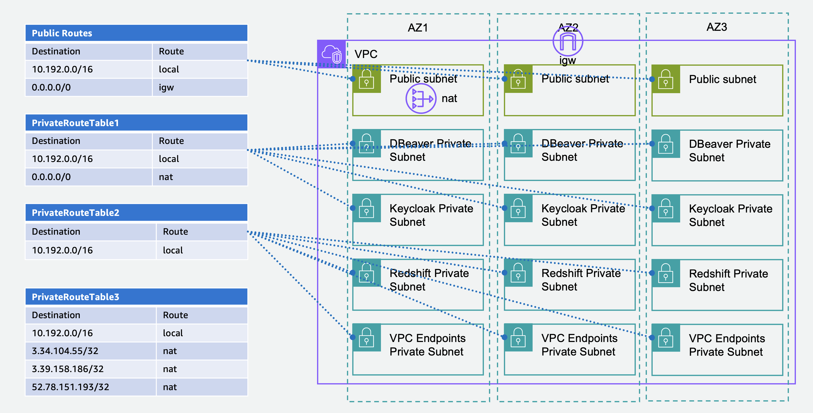

# redshift-serverless-with-saml
> Redshift Serverless, SAML, Keycloak, DBeaver

# VPC 구성
* 목표 아키텍처
<br>
</img>
</br>

* 다운로드 [YAML](https://github.com/shinjoonghoon/redshift-serverless-with-saml/blob/main/redshift-serverless-with-saml.yaml).
  - Stack name: `newbank`
  - EnvironmentName: `newbank`

* 환경 변수 정의
```
VPC_ID=
REGION=$(aws configure get region)
echo $VPC_ID
echo $REGION
```
* VPC 정보 조회
```
aws ec2 describe-vpcs --vpc-ids $VPC_ID
```
* 서브넷 정보 조회
```
aws ec2 describe-subnets --query 'sort_by(Subnets, &CidrBlock)[?(VpcId==`'$VPC_ID'`)].{CidrBlock: CidrBlock, SubnetId: SubnetId, Tags: Tags[?Key == `Name`].Value | [0]}' --output text
```

# VPC Endpoints 구성
* 목표 아키텍처
<br>
</img>
</br>

* VPC Endpoints 보안 그룹 생성
```
aws ec2 create-security-group --description "VPC_ENDPOINT_SG" --group-name "VPC_ENDPOINT_SG" --vpc-id $VPC_ID --output json | jq '.[]'
```
* VPC Endpoints 보안 그룹 Ingress 추가
```
aws ec2 authorize-security-group-ingress \
    --group-id $(aws ec2 describe-security-groups --query 'SecurityGroups[?(VpcId==`'$VPC_ID'` && GroupName==`VPC_ENDPOINT_SG`)].GroupId' --output text) \
    --protocol -1 --port -1 --cidr 10.192.0.0/16 \
    \
    --output json | jq '.[]'
```
* VPC Endpoints 서브넷 조회
```
aws ec2 describe-subnets \
--filters "Name=tag:Name,Values='newbank VPC Endpoints Private Subnet*'" \
--query 'sort_by(Subnets, &CidrBlock)[?(VpcId==`'$VPC_ID'`)].{CidrBlock: CidrBlock, SubnetId: SubnetId, Tags: Tags[?Key == `Name`].Value | [0]}' \
--output text
```
* VPC Endpoints 생성
```
myarray=(
com.amazonaws.$REGION.ssm
com.amazonaws.$REGION.ssmmessages
com.amazonaws.$REGION.ec2messages
com.amazonaws.$REGION.sts
)
for v in "${myarray[@]}"; do
    aws ec2 create-vpc-endpoint \
    --region $REGION  \
    --vpc-endpoint-type Interface \
    --vpc-id  $VPC_ID \
    --security-group-ids $(aws ec2 describe-security-groups --query 'SecurityGroups[?(VpcId==`'$VPC_ID'` && GroupName==`VPC_ENDPOINT_SG`)].GroupId' --output text) \
    --subnet-ids $(aws ec2 describe-subnets --filters "Name=tag:Name,Values='newbank VPC Endpoints*'" --query 'sort_by(Subnets, &CidrBlock)[?(VpcId==`'$VPC_ID'`)].[SubnetId]' --output text) \
    --service-name  $v \
    \
    --output json | jq '.[]'
done
```
```
aws ec2 create-vpc-endpoint \
    --region $REGION  \
    --vpc-endpoint-type Gateway \
    --vpc-id  $VPC_ID \
    --route-table-ids $(aws ec2 describe-route-tables --filters "Name=vpc-id,Values=$VPC_ID" --region ap-northeast-2 --query 'RouteTables[].RouteTableId' --output text) \
    --service-name com.amazonaws.$REGION.s3 \
    \
    --output json | jq '.[]'
```
```
aws ec2 create-vpc-endpoint \
    --region $REGION  \
    --service-name com.amazonaws.$REGION.s3 \
    --vpc-id  $VPC_ID \
    --subnet-ids $(aws ec2 describe-subnets --filters "Name=tag:Name,Values='newbank VPC Endpoints*'" --query 'sort_by(Subnets, &CidrBlock)[?(VpcId==`'$VPC_ID'`)].[SubnetId]' --output text) \
    --vpc-endpoint-type Interface  \
    --private-dns-enabled  \
    --ip-address-type ipv4 \
    --dns-options PrivateDnsOnlyForInboundResolverEndpoint=true \
    --security-group-ids $(aws ec2 describe-security-groups --query 'SecurityGroups[?(VpcId==`'$VPC_ID'` && GroupName==`VPC_ENDPOINT_SG`)].GroupId' --output text) \
    \
    --output json | jq '.[]'
```
* VPC Endpoints 조회
```
while true; do 
aws ec2 describe-vpc-endpoints --filters "Name=vpc-id,Values=$VPC_ID" --region $REGION  --query 'VpcEndpoints[].[State,VpcEndpointType,ServiceName]' --output text;
echo `date`; sleep 2; done;
```
* Network Insterface 조회
```
aws ec2 describe-network-interfaces --filters "Name=interface-type,Values=vpc_endpoint" "Name=vpc-id,Values=$VPC_ID" \
--query 'NetworkInterfaces[*].{NetworkInterfaceId:NetworkInterfaceId,PrivateIpAddress:PrivateIpAddress, GroupName:Groups[0].GroupName}' --output text
```

# Redshift Serverless 구성

<br>
</img>
</br>

* Redshift Serverless 보안 그룹 생성
```
aws ec2 create-security-group --description "REDSHIFT_SG" --group-name "REDSHIFT_SG" --vpc-id $VPC_ID --output json | jq '.[]'
```
* Redshift Serverless 보안 그룹 Ingress 추가
```
aws ec2 authorize-security-group-ingress \
    --group-id $(aws ec2 describe-security-groups --query 'SecurityGroups[?(VpcId==`'$VPC_ID'` && GroupName==`REDSHIFT_SG`)].GroupId' --output text) \
    --protocol -1 --port -1 --cidr 10.192.0.0/16 \
    \
    --output json | jq '.[]'
```
* Redshift Serverless 생성
* Port 변경
* Redshift Serverless Endpoint 확인
* Network Interfaces 확인

# Keycloak instance 구성
* 목표 아키텍처
<br>
</img>
</br>

* Keycloak instance 보안 그룹 생성
* Keycloak instance 보안 그룹 Ingress 추가
* Keycloak instance 생성
* Keycloak instance 정보 조회
* Keycloak instance 접속
* Java runtime 설치
* Keycloak download
* nslookup PrivateDnsName
* https 프로토콜을 사용하기 위해 키와 인증서 생성
* 8081 Port로 Keycloak 시작
* Keycloak Private Subnet의 Route Table 변경
<br>
</img>
</br>

# Windows Gateway instance 구성
* 목표 아키텍처
<br>
</img>
</br>

* Windows Gateway instance 보안 그룹 생성
* Windows Gateway instance 보안 그룹 Ingress 추가
* Windows Gateway instance 생성

# DBeaver Windows Client instance 구성
* 목표 아키텍처
<br>
</img>
</br>

* DBeaver Client instance 보안 그룹 생성
* DBeaver Client instance 보안 그룹 Ingress 추가
* DBeaver Client instance 생성

# DBeaver Windows Client instance에 접속
* Keycloak admin 접속 확인
* DBeaver 설치
* Redshift Serverless Endpoint 연결성 확인
  - Test-NetConnection
* Redshift JDBC driver 다운로드
* 새로운 드라이버 생성
* 새로운 Connection 생성
  - Admin user
* CloudWatch logs 확인

# Keycloak 새로운 Realm과 사용자 생성
* Realm 생성
* 사용자 생성
* 사용자 접속 확인

# AWS IAM Identity provider 구성
* SAML 2.0 Identity Provider Metadata 다운로드
* IAM Console 접속
* Add Provider
* saml provider arn 확인

# AWS IAM Role 추가
* role arn 확인

# Keycloak Client 구성
* AWS signin saml-metadata 다운로드
* Keycloak admin 접속
* Import Client
* Client Access settings

# DBeaver Test Connection
* 새로운 connection 생성
* login_url
* plugin_name
* Connection error
* SAML-tracer 확인
* Connection 생성
* Keycloak session 확인

# Keycolak Mapper(SAML Attribute) 구성
* Keycloak admin 접속
* Role
* RoleSessionName
* Role Name Mapper 구성

# Keycloak Group 생성

# Test Connection

# DBeaver Private Subnet의 Route Table 변경
PrivateRouteTable1 --> PrivateRouteTable2
<br>
</img>
</br>

# DBeaver Private Subnet의 Route Table 변경
PrivateRouteTable2 --> PrivateRouteTable3
<br>
</img>
</br>

# CloudTrail

# CloudWatch Logs

# VPC Flow Logs

# IP 기반 접근 제어

# Redshift provisioned cluster


