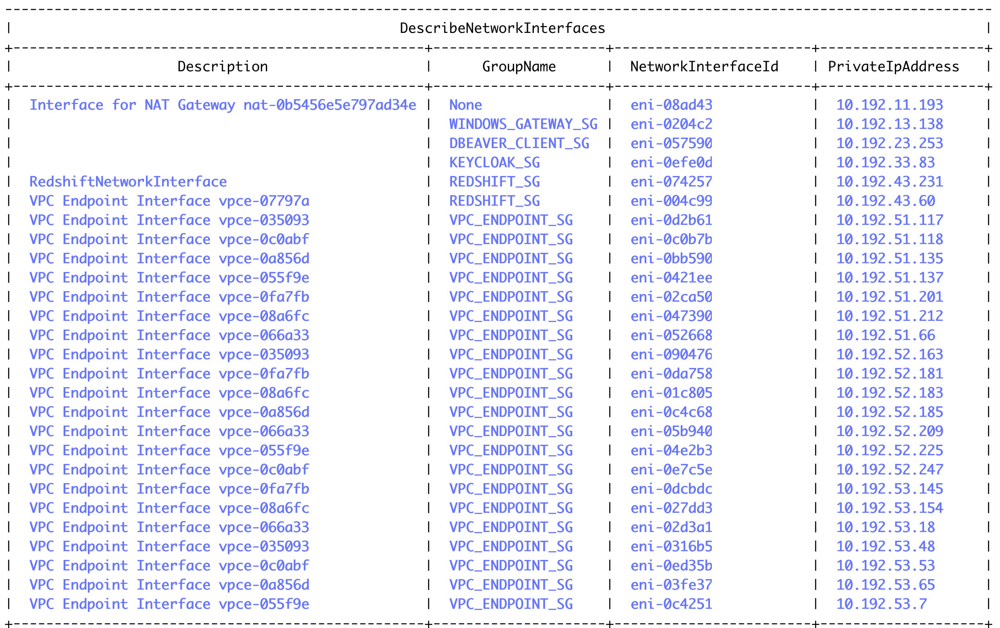

---

# AWS eni 정보

## 환경 변수 정의

```
REGION=$(aws configure get region)
ACCOUNT=$(aws sts get-caller-identity --query 'Account' --output text)
```

```
VPC_ID=$(aws ec2 describe-vpcs --region $REGION  --filter "Name=tag:Name,Values='newbank'" --query 'Vpcs[].VpcId' --output text)
```

```
echo $REGION
echo $ACCOUNT
echo $VPC_ID
```

```
aws ec2 describe-vpcs --vpc-ids $VPC_ID
```

## All the network interfaces in `newbank` VPC

```
aws ec2 describe-network-interfaces --filters "Name=vpc-id,Values=$VPC_ID" \
--query 'sort_by(NetworkInterfaces, &PrivateIpAddress)[].{NetworkInterfaceId:NetworkInterfaceId,PrivateIpAddress:PrivateIpAddress, GroupName:Groups[0].GroupName, Description: Description}' --output table
```

</img>


<!-- ---

## Keycloak eni

```
aws ec2 describe-instances \
--filters "Name=tag:Name,Values='Keycloak'" \
--query 'Reservations[].Instances[].NetworkInterfaces[].{NetworkInterfaceId: NetworkInterfaceId, PrivateIpAddress:PrivateIpAddress}'
```


## DBeaver eni

```
aws ec2 describe-instances \
--filters "Name=tag:Name,Values='DBeaver Windows Client'" \
--query 'Reservations[].Instances[].NetworkInterfaces[].{NetworkInterfaceId: NetworkInterfaceId, PrivateIpAddress:PrivateIpAddress}'
```


## endpoint enis

```
aws ec2 describe-network-interfaces --filters "Name=interface-type,Values=vpc_endpoint" "Name=vpc-id,Values=$VPC_ID" \
--query 'NetworkInterfaces[*].{NetworkInterfaceId:NetworkInterfaceId,PrivateIpAddress:PrivateIpAddress, GroupName:Groups[0].GroupName}' --output text
```
-->

## AWS endpoint service name으로 ENIs 조회

```
aws ec2 describe-vpc-endpoints --filters "Name=service-name,Values=com.amazonaws.ap-northeast-2.sts" "Name=vpc-id,Values=$VPC_ID" \
--query 'VpcEndpoints[*].{VpcEndpointId: VpcEndpointId, ServiceName: ServiceName, NetworkInterfaceIds: NetworkInterfaceIds}' \
--output json
```


## VPC Endpoint IDs로 AWS endpoint service name 조회

```
aws ec2 describe-vpc-endpoints --vpc-endpoint-ids "VpcEndpointId" \
--query 'VpcEndpoints[*].{ServiceName: ServiceName}' --output json
```

---

## nslookup [Redshift Serverless API endpoint]

```
nslookup redshift-serverless.ap-northeast-2.amazonaws.com
```

Output
```
Non-authoritative answer:
Name:	redshift-serverless.ap-northeast-2.amazonaws.com
Address: 3.34.104.55
Name:	redshift-serverless.ap-northeast-2.amazonaws.com
Address: 3.39.158.186
Name:	redshift-serverless.ap-northeast-2.amazonaws.com
Address: 52.78.151.193
```

---

# Athena Query

- [Amazon VPC 흐름 로그 쿼리](https://docs.aws.amazon.com/ko_kr/athena/latest/ug/vpc-flow-logs.html)
- [protocol numbers](https://www.iana.org/assignments/protocol-numbers/protocol-numbers.xhtml)

> `interface_id`를 기준으로 `flow_direction`이 `egress`인 `dstaddr`와 `dstport`를 확인합니다.

```
select flow_direction, protocol, srcaddr, srcport, dstaddr, dstport
     , count(version) rowscnt
  from "default"."newbankvpcflowlogs" a
 where date = to_Char(now(), 'yyyy/mm/dd')
   and interface_id in ('eni-05759000000000000') -- DBeaver Windows Client NetworkInterfaceId
   and start > cast(to_unixtime(now() - interval '60' minute) as integer)
 group by flow_direction, protocol, srcaddr, srcport, dstaddr, dstport
having flow_direction = 'egress'
 order by dstaddr, dstport
```

```
#	flow_direction	protocol	srcaddr	srcport	dstaddr	dstport	rowscnt
1	egress	6	10.192.23.253	3389	10.192.13.138	49567	57
2	egress	17	10.192.23.253	3389	10.192.13.138	60238	57
3	egress	6	10.192.23.253	53801	10.192.33.83	8081	1
4	egress	6	10.192.23.253	53802	10.192.33.83	8081	24
5	egress	6	10.192.23.253	53800	10.192.33.83	8081	1
6	egress	6	10.192.23.253	53796	10.192.33.83	8081	26
7	egress	6	10.192.23.253	53795	10.192.33.83	8081	1
8	egress	6	10.192.23.253	53813	10.192.43.60	5454	1
9	egress	6	10.192.23.253	53609	10.192.43.60	5454	33
10	egress	6	10.192.23.253	53608	10.192.43.60	5454	33
11	egress	6	10.192.23.253	53610	10.192.43.60	5454	33
12	egress	6	10.192.23.253	53746	10.192.51.212	443	1
13	egress	6	10.192.23.253	53846	10.192.51.212	443	1
14	egress	6	10.192.23.253	53847	10.192.51.212	443	2
15	egress	6	10.192.23.253	53839	10.192.51.212	443	1
16	egress	6	10.192.23.253	53829	10.192.51.212	443	1
17	egress	6	10.192.23.253	53785	10.192.51.212	443	1
18	egress	6	10.192.23.253	53836	10.192.51.212	443	1
19	egress	6	10.192.23.253	53778	10.192.51.212	443	1
20	egress	6	10.192.23.253	53771	10.192.51.212	443	1
21	egress	6	10.192.23.253	53820	10.192.51.212	443	1
22	egress	6	10.192.23.253	53770	10.192.52.183	443	1
23	egress	6	10.192.23.253	53763	10.192.52.183	443	1
24	egress	6	10.192.23.253	53753	10.192.52.183	443	1
25	egress	6	10.192.23.253	53793	10.192.52.183	443	1
26	egress	6	10.192.23.253	53786	10.192.52.183	443	1
27	egress	6	10.192.23.253	53854	10.192.52.183	443	1
28	egress	6	10.192.23.253	53811	10.192.52.209	443	1
29	egress	6	10.192.23.253	53861	10.192.53.154	443	1
30	egress	6	10.192.23.253	53760	10.192.53.154	443	1
31	egress	6	10.192.23.253	53376	10.192.53.7	443	57
32	egress	6	10.192.23.253	53812	3.39.158.186	443	1

```